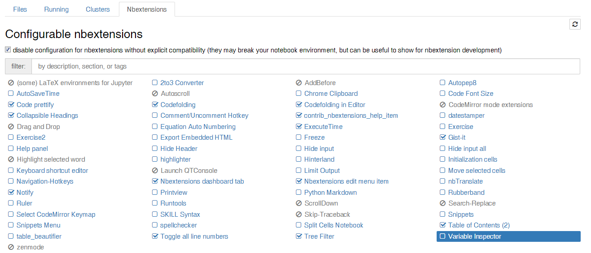

Jungle video trap challenge solution by AVeysov and SKolbachev
==============================

- Classifying animals using jungle trap videos (200k+, 1TB) with 90%+ accuracy with CNNs;
- Also visit out [blog](https://spark-in.me/tag/group-data-science) and [channel](https://t.me/snakers4) (seriously!);

To replicate our final result from [here](https://www.drivendata.org/competitions/49/deep-learning-camera-trap-animals/leaderboard/) you need more or less to follow these steps:

1. Download the dataset from [here](https://www.drivendata.org/competitions/49/deep-learning-camera-trap-animals/) - (see some hints below);
2. Build the environment via the below Dockerfile;
3. Extract the features and metadata from the videos;
4. Run the final models;


Project Organization
------------

    ├── LICENSE
    ├── README.md           <- The top-level README for developers using this project.
    ├── data
    │   ├── interim         <- Extracted features and metadata
    │   ├── micro           <- The original micro dataset (64x64 videos)
    │   └── raw             <- The original unpacked 1TB raw full size video dataset
    │
    ├── models              <- Trained and serialized models, model predictions, or model summaries
    │
    ├── notebooks           <- Jupyter notebooks (provided just fyi for completeness)
    │
    ├── Dockerfile          <- The Dockerfile to build the environment
    │
    ├── src                 <- Source code for use in this project.
    │   ├── extract_features    <- Extracts CNN features
    │   └── extract_meta_data   <- Extracts video meta-data
    │
    └── test_environment.py <- A set of small scripts to test the environment

Downloading data
------------

Download and unpack the following datasets to their respective folders from [here](https://www.drivendata.org/competitions/49/deep-learning-camera-trap-animals/data/):
- data/raw - the full 1TB dataset
- data/micro - micro dataset

Download the annotation files and micro dataset using the below jupyter notebook snippet:

```
import collections

file_dict = collections.OrderedDict()
file_dict['data/submission.csv'] = 'https://s3.amazonaws.com/drivendata/data/49/public/submission_format.csv'
file_dict['data/train.csv'] = 'https://s3.amazonaws.com/drivendata/data/49/public/train_labels.csv'
file_dict['data/micro/micro_chimps.tgz'] = 'https://s3.amazonaws.com/drivendata-public-assets/micro_chimps.tgz'

for file,url in file_dict.items():
    url_q = "'" + url + "'"
    ! wget --continue --no-check-certificate --no-proxy -O $file $url_q

```

For the full dataset you will have to be more creative, I recommend using [this](https://help.ubuntu.com/community/TransmissionHowTo).

Setting up the environment
------------

Key dependencies:
- Ubuntu 16.04;
- CUDA + CUDNN + Nvidia GPU;
- Docker and nvidia-docker;
- This pre-trained model [zoo](https://github.com/Cadene/pretrained-models.pytorch);

Make sure that you are familiar with Docker and building docker images from Dockerfiles and [nvidia-docker](https://github.com/NVIDIA/nvidia-docker).

Use the provided Dockerfile to build an environment.
Change the **ENTER_YOUR_PASS_HERE** placeholder to the desired root password (is necessary if you want to ssh remotely into the container).

The following libraries may have to be installed manually by logging into the container:
- ```pip3 install moviepy```
- ```pip3 install git+https://github.com/aleju/imgaug```
- ```pip3 install sk-video```

If you are not familiar with Docker, consider following / reading these materials:
- [Docker](https://towardsdatascience.com/how-docker-can-help-you-become-a-more-effective-data-scientist-7fc048ef91d5) for data science;
- A series of posts on our channel with useful links [1](https://t.me/snakers4/1476) [2](https://t.me/snakers4/1479) (if you do not speak Russian - just follow links - they ultimately link to Enlish articles mostly);

**Warning**
On some machines jupyter extenstions give me hell during installation, or they just do no work.
Alternative ways of intallation

```
# A NOTE ON ENABLING JPN EXTENSIONS
# sometimes pip install does not work on some systems
# installation from source solves the problem
git clone https://github.com/ipython-contrib/jupyter_contrib_nbextensions.git
pip install -e jupyter_contrib_nbextensions
jupyter contrib nbextension install --system

# or install via pip from repository
pip install git+https://github.com/ipython-contrib/jupyter_contrib_nbextensions
jupyter contrib nbextension install --system
```


Running the environment
------------

1. Build the container;
2. Make sure you have all the necessary ports exposed (i.e. 8888 for jupyter and 6006 for tensorboard);
3. Use the below commands to run the container;
4. Use ```docker exec -it --user root CONTAINER_ID /bin/bash``` to ssh into docker locally;
5. You may also add ssh port pass-though (into EXPOSE statement and into docker run) and ssh into container remotely. Also you may change password auth to ssh-key;

For nvidia-docker use:

```
nvidia-docker run -it -v /PATH/TO/YOUR/FOLDER:/home/keras/notebook -p 8888:8888 -p 6006:6006 --shm-size 8G YOUR_DOCKER_IMAGE_NAME --runtime=nvidia 
```

For nvidia-docker 2 use:

```
docker run --runtime=nvidia -e NVIDIA_VISIBLE_DEVICES=all -it -v /PATH/TO/YOUR/FOLDER:/home/keras/notebook -p 8888:8888 -p 6006:6006 --shm-size 8G YOUR_DOCKER_IMAGE_NAME    
```

Note that without ```--shm-size``` Pytorch data loaders will not work.

Testing the environment
------------

1. Run test_environment.py - and make sure it works;
2. The only key major change that occured recently is Pytorch 0.3 being released, but this should not cause any issues - but be cautious;
3. Not all keras + tf versions are friednly with each other - run at least one test from [here](https://github.com/nerox8664/pytorch2keras) to make sure error is low;


Extracting features and meta-data
------------

You may consider fine-tuning the encoders (which performed strangely on validation for us - and therefore we failed to utilize them fully) or building end2end pipeline (which we also did), but the easiest and fastest way is to 
- extract features
- use them as inputs to meta-model

Run the following scripts sequentially. Note that on 2 Nvidia 1080 Ti GPUs each feature set (train+test) took ~ 1 day to unpack.

- Extract meta-data
```
python3 src/extract_meta_data/extract_meta_data.py
```
- Create folders
```
mkdir -p ../../data/interim/inception4_test
mkdir -p ../../data/interim/inception4_train

mkdir -p ../../data/interim/ir_test
mkdir -p ../../data/interim/ir_train

mkdir -p ../../data/interim/nasnet_test
mkdir -p ../../data/interim/nasnet_train

mkdir -p ../../data/interim/resnet_test
mkdir -p ../../data/interim/resnet_train

```
- Extract features via running these python scripts
```
python3 src/extract_features/inception4_extract_test.py
python3 src/extract_features/inception4_extract_train.py
python3 src/extract_features/inception_resnet_extract_test.py
python3 src/extract_features/inception_resnet_extract_train.py
python3 src/extract_features/nasnet_extract_test.py
python3 src/extract_features/nasnet_extract_train.py
python3 src/extract_features/resnet_extract_test.py
python3 src/extract_features/resnet_extract_train.py
```


Training the final model 
------------
[SK to fill]

Supplementary materials 
------------
Provided just fyi, use at your own risk.

---

Notebooks are best opened with the following [extensions](https://github.com/ipython-contrib/jupyter_contrib_nbextensions) enabled:


---


Notebooks:
- jungle.ipynb - data expoloration + various pipelines and experiments
- playing_with_extractors.ipynb - playing with Pytorch feature extractors
- video_loading_benchmark.ipynb - playing with several video processing libraries
